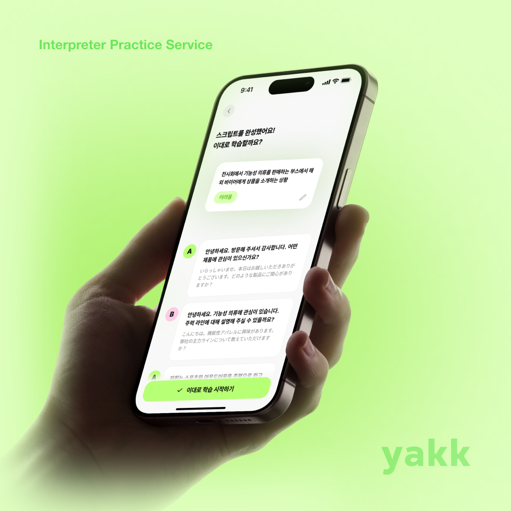

# 🗣️ yakk (야크) - 동시통역 학습 서비스

  

> [!NOTE]
> 일본어를 공부하면서 통역 상황을 직접 경험해보고 싶었던 적 있지 않나요?  
> **yakk**는 일본어 학습자 누구나 **한-일 동시통역 상황**을 연습해볼 수 있도록 설계된 웹 기반 학습 서비스입니다.
>
> _공연장에서 아티스트의 멘트를 통역하거나, 일본인 친구에게 한국을 소개할 때 머리가 꼬였던 경험_  
> 그런 상황을 직접 재현하며 연습할 수 있어요.
>
> **AI 기반 자동 생성 스크립트** 또는 **자신만의 스크립트 업로드**로 자유롭게 학습할 수 있습니다✏️
