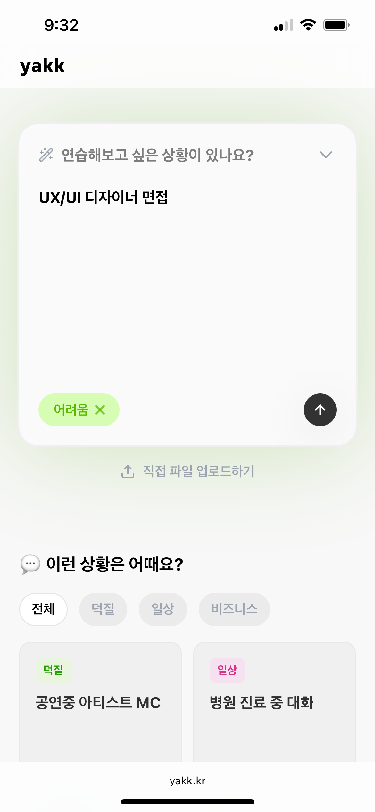
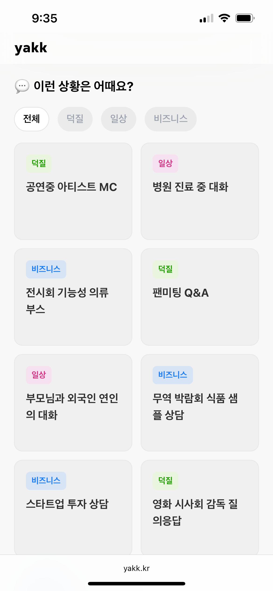
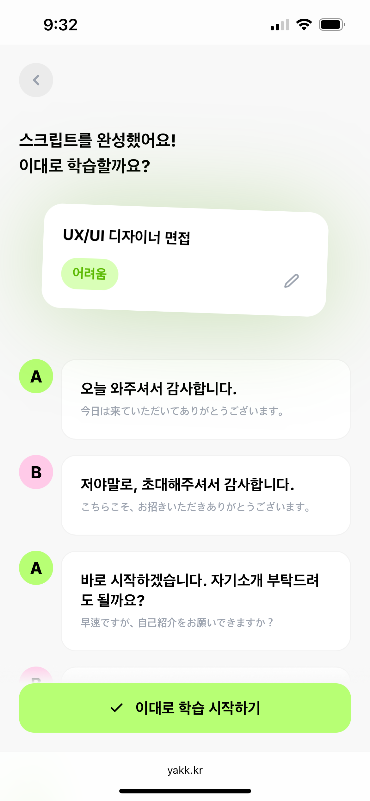
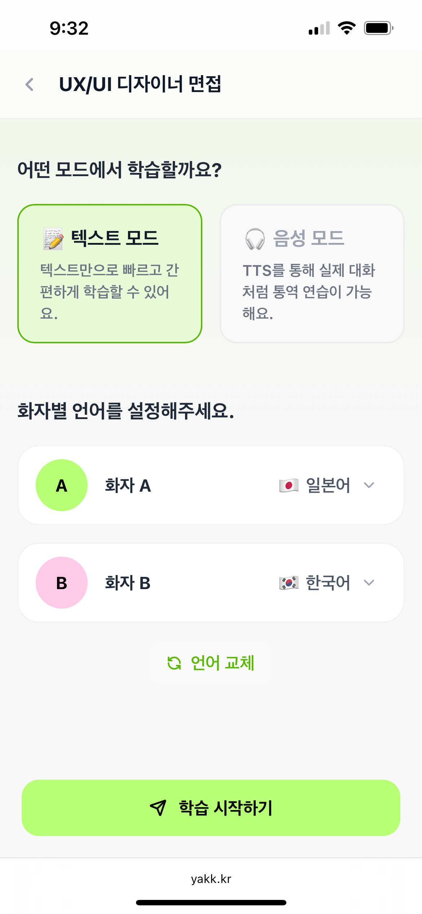
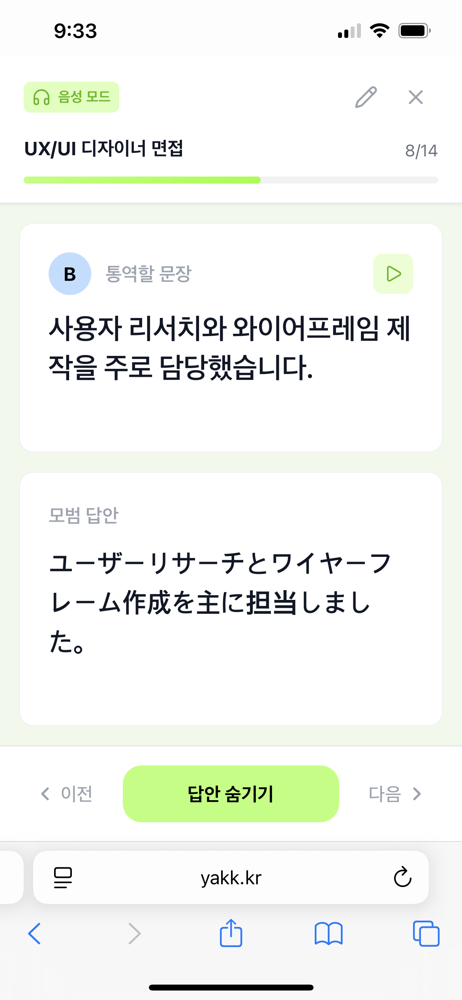
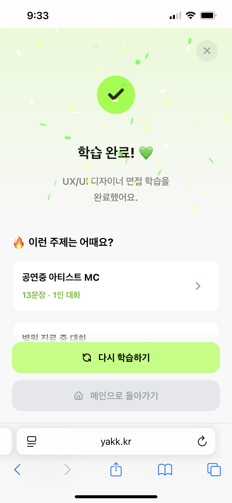
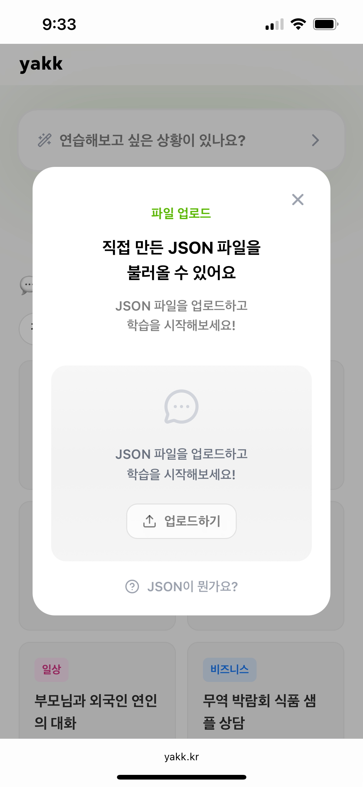
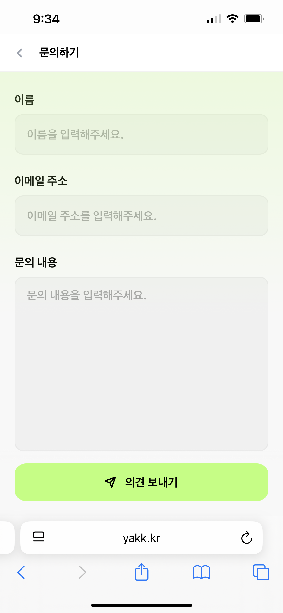

# 🗣️ yakk (야크) - 동시통역 학습 앱

  

> [!TIP]
> 외국어를 공부하면서 통역 상황을 직접 경험해보고 싶었던 적 있지 않나요?  
> **yakk**는 외국어 학습자 누구나 **동시통역 상황**을 연습해볼 수 있도록 설계된 웹 기반 학습 서비스입니다.  
>  
> *공연장에서 아티스트의 멘트를 통역하거나, 외국어-한국어를 번갈아 사용하며 머리가 꼬였던 경험*  
> 그런 상황을 직접 재현하며 연습할 수 있어요.  
>  
> **AI 기반 자동 생성 스크립트** 또는 **자신만의 스크립트 업로드**로 자유롭게 학습할 수 있습니다✏️

## 🚀 주요 기능 소개

| 🏠 메인 화면 | 🧪 예시 학습 | ✨ AI 스크립트 자동 생성 | ⚙️ 학습 모드 설정 |
|-------------|-------------|-----------------------|-------------------|
|  |  |  |  |

| 🗣️ 동시 통역 학습 | ✅ 학습 완료 및 추천 학습 | 📂 나만의 스크립트 업로드 | 📬 문의하기 |
|-------------------|-----------------------------|----------------------------|------------|
|  |  |  |  |
